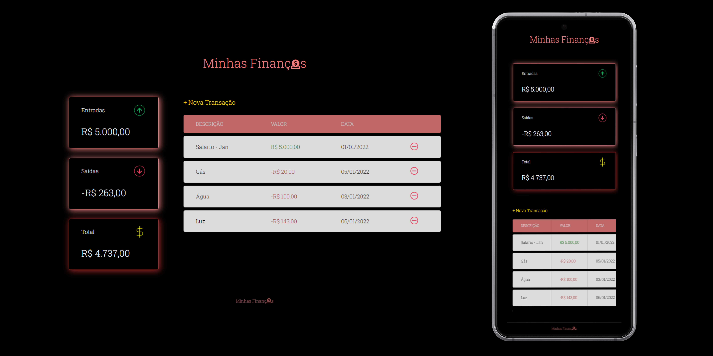

<div align="center">
    <h1>My Finances</h1>
	
</div>

<br>

## :dart: Objetivo

Dando meus primeiros passos com JavaScript, com a MaratonaDiscover da [Rocketseat](https://app.rocketseat.com.br/node/maratona-discover-edicao-01). Onde foi proposto a criação de uma aplicação para aplicar os conceitos dessa linguagem que vem ganhando muito espaço no mercado nos últimos anos.
Foram 4 aulas, apresentando conceitos de HTML, CSS e JavaScript, com o instrutor trazendo sua visão de mercado e boas práticas.
Sendo assim a ideia é construir um app de controle de finanças. O tema do projeto é livre, e decidi fazer meu próprio design com HTML e CSS.
Em nova transação, conseguimos adicionar todas as nossas transações. No botão de - (menos) na tabela, conseguimos deletar transações. A aplicação é totalmente responsiva e utilizando através do celular, conseguimos mover a tabela para os lados usando o touch para visualizar todas as informações. 
O armazenamento de dados na aplicação foi feito em LocalStorage.

<br>

## :rocket: Deploy 

Github Pages

url: https://camilaaguiar.github.io/my-finances/

<br>

## Linguagens

<div>

HTML


<hr>

CSS


<hr>

JavaScript


</div>

<br>

 ## :cd: Executando o Projeto

```bash
git clone git@github.com:CamilaAguiar/my-finances.git
```
ou

```bash
git clone https://github.com/CamilaAguiar/my-finances.git
```

<br>

## :hourglass: Status do Projeto

:wrench: Em construção :wrench:

O projeto vai continuar sendo desenvolvido. Todo o conhecimento que eu for adquirindo vai contribuir para a melhoria contínua do mesmo.